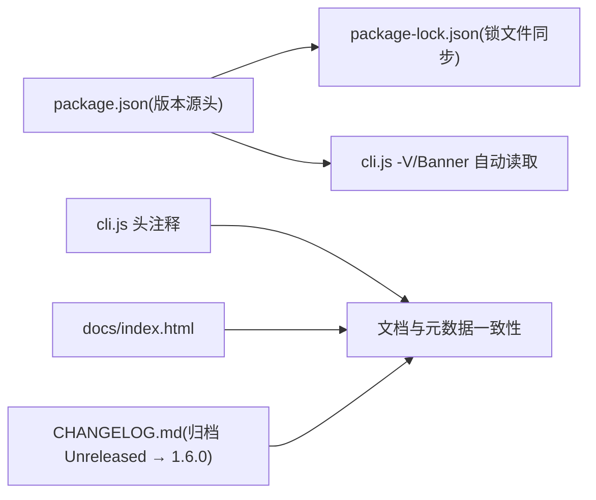

## 产品概述

为现有 Node.js CLI 工具 bili-pinned-card 完成一次**版本发布记账**：把上一轮已完成（且已通过 222 用例 / 语法检查 / 类型检查）的四项重构与两项新功能正式归档为 **1.6.0**，并顺带核查依赖锁文件的一致性。本次**只改文件、不碰 git、不发布**，提交时机由用户自行决定。

## 核心功能

- **版本号统一升级至 1.6.0**：package.json、package-lock.json（顶层与根包两处）、cli.js 文件头注释、文档站版本标识全部同步；`-V`/Banner 无需改逻辑（已从 package.json 单一来源读取）。
- **CHANGELOG 归档**：把现有 `## [Unreleased]` 段落定为 `## [1.6.0] - 2026-09-25`（内容为新增 `--rule` 内容规则、`--notify-webhook` 事件推送；卡片渲染层去重、monitor 主流程拆分、check 脚本工程化；测试 189 → 222）。
- **文档展示同步**：docs/index.html 首页版本标签改为 v1.6.0，Releases 描述区间改为 `v1.0.0 → v1.6.0`。
- **依赖一致性核查**：验证 package.json 与 package-lock.json 中 typescript / @types/node / @types/qrcode 的解析版本一致、lock 可复现；仅在实测出现不一致或解析失败时才重新解析。
- **发布前终检**：`npm test`、`npm run check`、`npm run typecheck` 三项全绿，`node cli.js -V` 输出 1.6.0。

## 技术栈选择

沿用项目现有栈，不引入任何新工具：

- **运行时**：Node.js ≥ 18（CommonJS 单包 CLI，`bin: bili-pinned-card → cli.js`）
- **运行时依赖**：`@resvg/resvg-js`、`qrcode`（保持不变）
- **开发依赖**：`typescript`（^7.0.2，仅用于 `tsc --noEmit` 类型校验）、`@types/node`、`@types/qrcode`
- **测试**：Node 内置 `node --test`（test/ 下 16 个用例文件，共 222 用例）
- **静态检查**：`scripts/check-syntax.js`（遍历 cli.js/lib/test/scripts 全部 `.js` 执行语法校验）
- **文档站**：`docs/index.html` 纯静态 HTML，无构建步骤

## 实施方案

思路：**版本发布记账（release bookkeeping）**，不改动任何运行时代码逻辑，只把已有工作成果"盖章"到 1.6.0，并做一次 lock 完整性体检。

**关键决策与理由**

1. **版本取 1.6.0（minor）**：本轮新增 `--rule` 内容规则与 `--notify-webhook` 事件推送两项向后兼容的对外功能，且默认关闭/未配置时缺省行为零变化，属新增功能而非破坏性变更，符合 semver minor。
2. **单一版本来源**：`cli.js:31` 已 `require('./package.json')` 读取版本，Banner 与 `-V` 输出自动跟随。因此**只改 `cli.js` 第 4 行注释**，不改任何逻辑，避免引入双份版本常量。
3. **lock 文件只改版本字段**：`package-lock.json` 仅动第 3 行（顶层 `version`）与第 9 行（`packages[""].version`）；**严禁触碰 `resolved` / `integrity` / 依赖版本树**，否则会破坏 `npm ci` 的可复现性。
4. **依赖"排查"的正确落点是验证而非重装**：已知 `package-lock.json` 中 `typescript` 及平台原生包均为 7.0.2，与 `package.json` 的 `^7.0.2` 区间一致，并非漂移；`tsc --noEmit` 实测可用。故先用 `npm ls` + `npm ci --dry-run` 做一致性断言，**仅当出现实际不一致/解析失败时才重新解析 lock**，并**禁止擅自降级 typescript 主版本**（会破坏 `@typescript/*` 原生包结构与 typecheck）。
5. **CHANGELOG 遵循 Keep a Changelog**：把 `## [Unreleased]` 改为 `## [1.6.0] - 2026-09-25`，条目原文一字不改（当前文件底部无链接引用段，无需额外补链）。
6. **历史版本引用保留**：`lib/rule.js:5` 的 "v1.5.0 缺省行为零变化" 是"相对上一已发布版本"的历史对照说明，语义正确，**保持不动**，避免出现"新版本自比自身"的错误表述。

**性能与可靠性**：本次变更全部为文本级修改，对运行时性能、内存与包体积零影响；验证阶段仅跑测试与类型检查，成本约数十秒。仓储配置侧已确认 `.github/workflows/release.yml` 采用"package.json 版本 vs tag 比对"的校验逻辑、`ci.yml` 仅声明 Node 18/20/22 矩阵，**均无硬编码版本号需同步**。

## 实施注意（执行细节）

- **环境前置**：本机 node/npm 不在默认 PATH，须先执行 `export PATH="$HOME/.workbuddy/binaries/node/versions/22.12.0/bin:$PATH"`，再运行任何 npm 命令。
- **严格控制爆炸半径**：本轮**禁止**执行 `git add/commit/tag/push`、`npm publish`、`npm version`（会隐式产生 git tag/commit），仅做文件编辑与本地验证。
- **精确改动清单（共 5 个文件、7 处）**：
- `package.json:3` `"version": "1.5.0"` → `"1.6.0"`
- `package-lock.json:3` 与 `package-lock.json:9` 两处 `"version": "1.5.0"` → `"1.6.0"`
- `cli.js:4` 头注释 `v1.5.0` → `v1.6.0`
- `docs/index.html:159` `<span>v1.5.0</span>` → `v1.6.0`；`docs/index.html:314` `v1.0.0 → v1.5.0` → `v1.0.0 → v1.6.0`
- `CHANGELOG.md:5` 标题行归档
- **无关命中不可误改**：`lib/args.js` 的 `1.5`（倍率示例）、`lib/card/*` 的 `1.5`（stroke-width/字号）、`test/*` 的 `1.5` 断言、`package.json` 的 `^1.5.4`/`^1.5.6` 依赖区间、`CHANGELOG.md` 历史段落里的 1.5 均为含义不同的文本，**不得替换**。
- **验证方式**：`node cli.js -V` 应输出 `1.6.0`；`npm test` 须 222 用例全通过；`npm run check` 覆盖 48 个 `.js`；`npm run typecheck` 零错误。

## 架构设计

本任务不涉及架构变更，仅做发布元数据同步，改动面为"包元数据 + 静态文档 + 变更日志"三条互不耦合的支路：



## 目录结构

```
bili-pinned-card/
├── package.json          # [MODIFY] 第 3 行 version 1.5.0 → 1.6.0（版本唯一权威来源）
├── package-lock.json     # [MODIFY] 仅第 3 行顶层 version 与第 9 行 packages[""].version → 1.6.0；其余字段（resolved/integrity/依赖树）保持原样
├── cli.js                # [MODIFY] 仅第 4 行文件头注释 v1.5.0 → v1.6.0；第 31 行版本读取逻辑与任何其他逻辑均不得改动
├── CHANGELOG.md          # [MODIFY] 第 5 行 ## [Unreleased] → ## [1.6.0] - 2026-09-25，其下「新增/优化/测试」三段条目原文保留
├── docs/index.html       # [MODIFY] 第 159 行首页版本标签 v1.5.0 → v1.6.0；第 314 行 Releases 描述区间 → v1.0.0 → v1.6.0
└── lib/rule.js           # [KEEP] 第 5 行 v1.5.0 为历史对照说明，保持不动
```

## Agent Extensions

### SubAgent

- **code-explorer**
- Purpose: 在动手改动前做一次"穷尽式版本引用核查"，以 medium 力度扫描全仓（含 .github/workflows、docs/、README、types.d.ts、scripts/），确认除已定位的 7 处外没有遗漏的 1.5.0 版本引用或版本闸门，并核对 package.json / package-lock.json 中 typescript、@types/node、@types/qrcode 的声明区间与实际解析版本是否一致。
- Expected outcome: 输出一份"待改清单 + 无需改动/不可误改清单（含 args 倍率、card 字号、依赖区间等假命中）"与依赖一致性结论，作为编辑与验证阶段的执行依据，杜绝漏改与误改。